# Documentación Swagger por endpoint

Detalle de cada endpoint protegido con JWT (Keycloak, realm `biblioteca`) en los 4 microservicios, capturado desde Swagger UI. Para las vistas generales de cada servicio (con el botón "Authorize"), ver [swagger-screenshots/](swagger-screenshots/).

---

## circulacion-service (`http://localhost:8083`)

### POST /circulacion/prestar — Prestar un libro

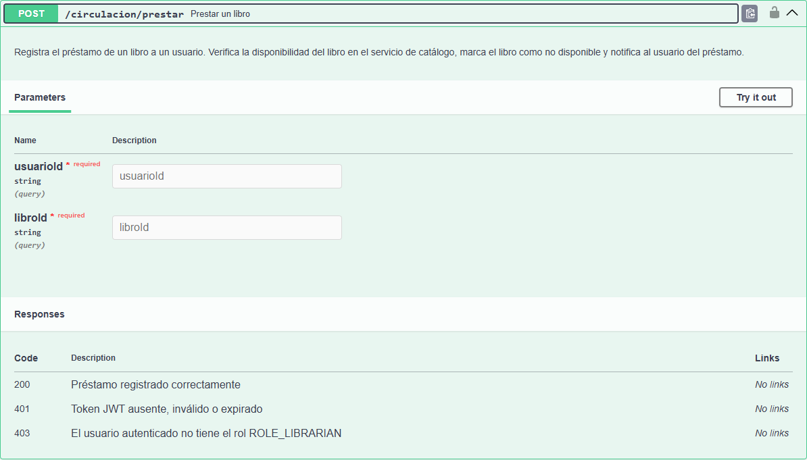

Registra el préstamo de un libro a un usuario. Verifica la disponibilidad del libro en el servicio de catálogo, marca el libro como no disponible y notifica al usuario del préstamo (vía Feign a `catalogo-service` y `notificacion-service`, propagando el JWT del llamador).

- **Parámetros:** `usuarioId` (query, requerido), `libroId` (query, requerido)
- **Autorización:** `ROLE_LIBRARIAN`
- **Respuestas:** `200` Préstamo registrado · `401` Token JWT ausente/inválido/expirado · `403` Rol incorrecto

### POST /circulacion/devolver — Devolver un libro

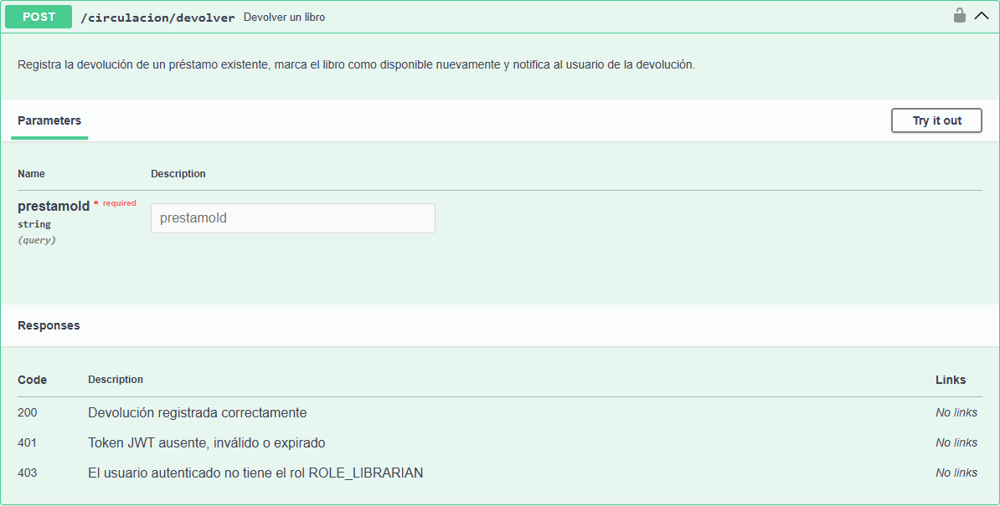

Registra la devolución de un libro previamente prestado, actualizando su disponibilidad en el catálogo.

- **Autorización:** `ROLE_LIBRARIAN`
- **Respuestas:** `200` Devolución registrada · `401` Token JWT ausente/inválido/expirado · `403` Rol incorrecto

### GET /circulacion/public/status — Estado del servicio

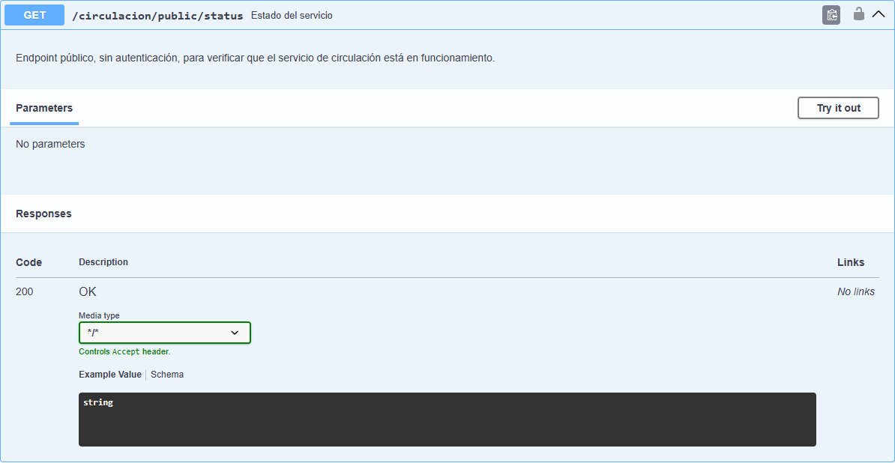

Endpoint público de verificación de estado (health-check), no requiere autenticación.

- **Autorización:** ninguna (`permitAll`)
- **Respuestas:** `200` Servicio disponible

### GET /circulacion/prestamos — Consultar todos los préstamos

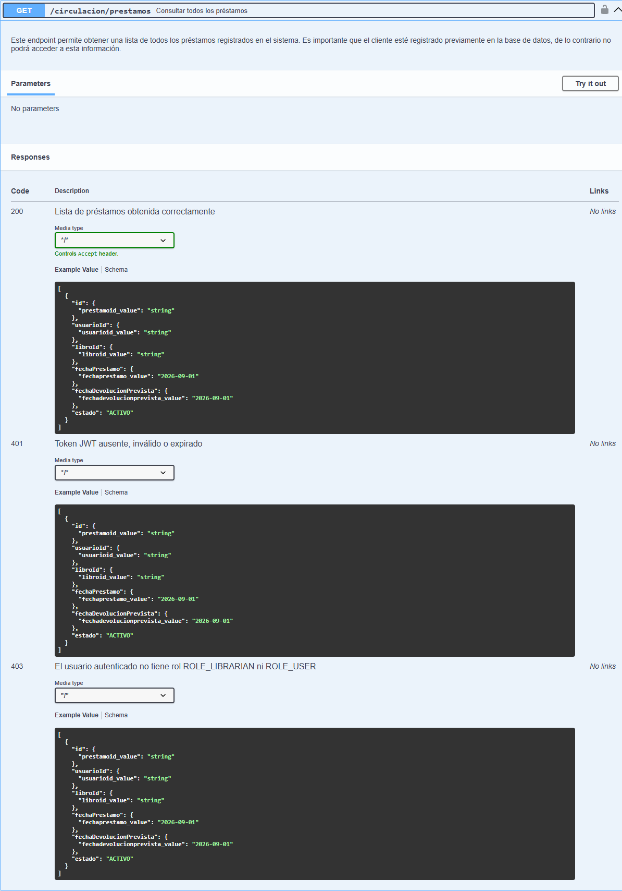

Lista todos los préstamos registrados en el sistema.

- **Autorización:** `ROLE_LIBRARIAN` o `ROLE_USER`
- **Respuestas:** `200` Lista de préstamos · `401` Token JWT ausente/inválido/expirado

---

## catalogo-service (`http://localhost:8082`)

### GET /libros/{id} — Consultar un libro

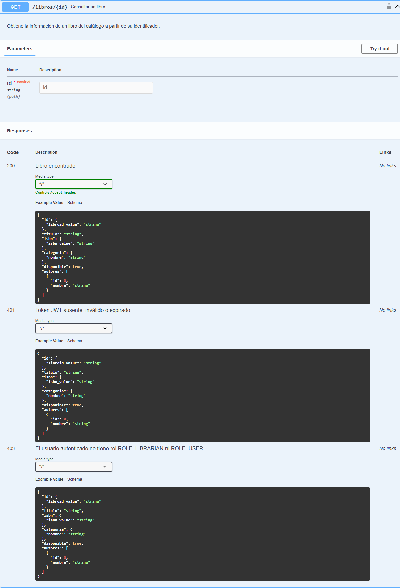

Obtiene la información de un libro del catálogo a partir de su identificador.

- **Parámetros:** `id` (path, requerido)
- **Autorización:** `ROLE_LIBRARIAN` o `ROLE_USER`
- **Respuestas:** `200` Libro encontrado · `401` Token JWT ausente/inválido/expirado · `403` Rol incorrecto

### GET /libros/{id}/disponible — Consultar disponibilidad de un libro

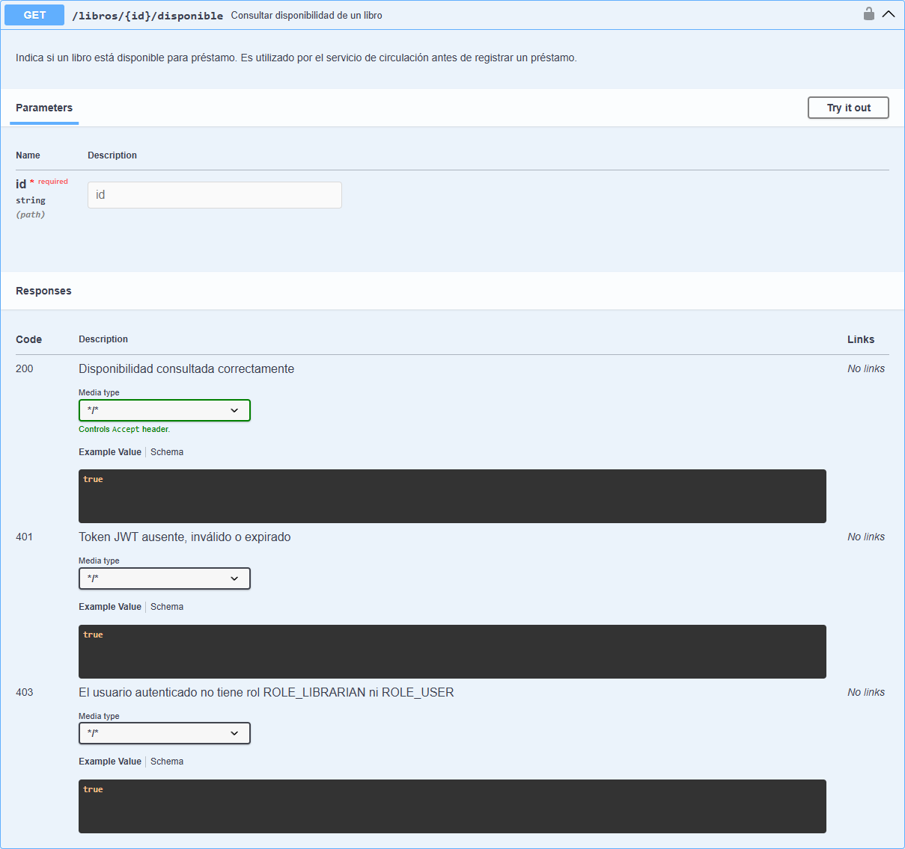

Consulta si un libro específico está actualmente disponible para préstamo.

- **Parámetros:** `id` (path, requerido)
- **Autorización:** `ROLE_LIBRARIAN` o `ROLE_USER`
- **Respuestas:** `200` Disponibilidad consultada · `401` Token JWT ausente/inválido/expirado · `403` Rol incorrecto

### GET /libros/buscar — Buscar libros

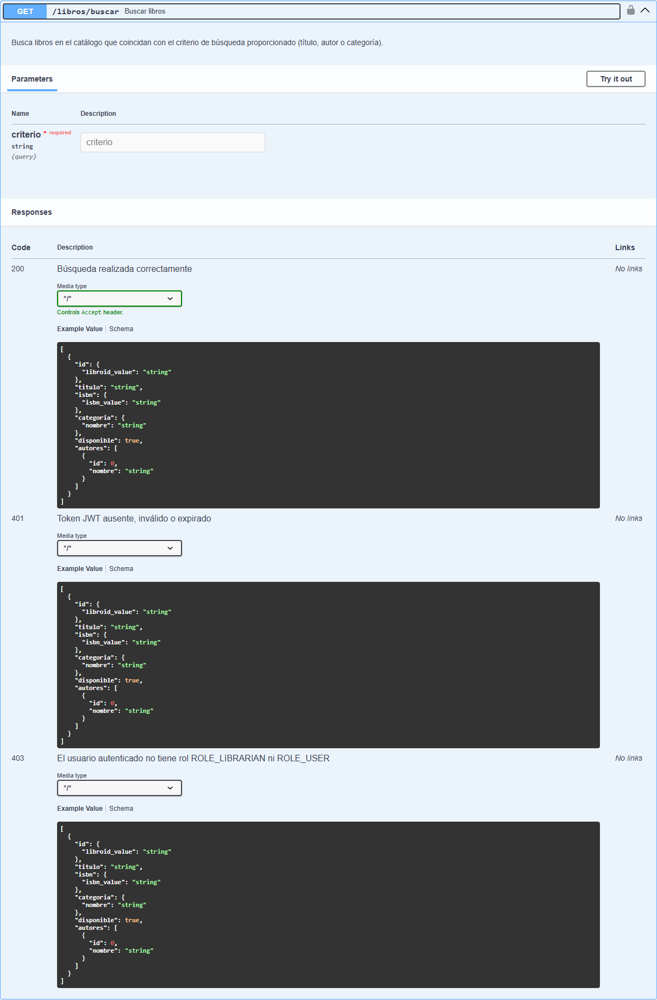

Busca libros en el catálogo según criterios de búsqueda (título, autor, categoría, etc.).

- **Autorización:** `ROLE_LIBRARIAN` o `ROLE_USER`
- **Respuestas:** `200` Resultados de la búsqueda · `401` Token JWT ausente/inválido/expirado · `403` Rol incorrecto

### PUT /libros/{id}/disponibilidad — Actualizar disponibilidad de un libro

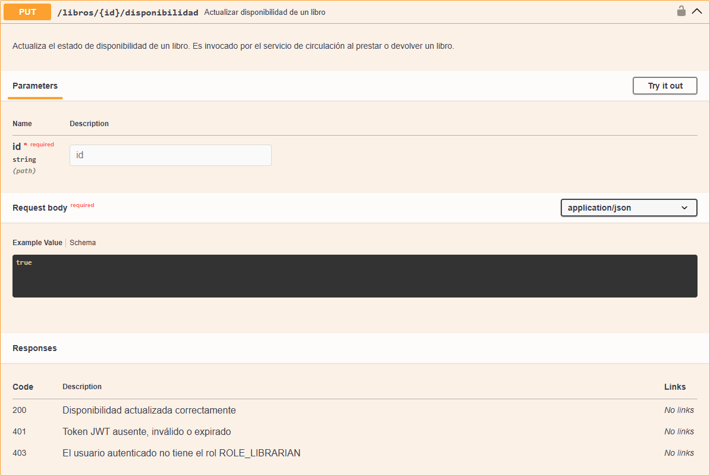

Actualiza el estado de disponibilidad de un libro. Es invocado internamente por `circulacion-service` (vía Feign) al prestar o devolver un libro, pero también queda expuesto directamente aquí.

- **Parámetros:** `id` (path, requerido)
- **Autorización:** `ROLE_LIBRARIAN` (a diferencia de las consultas, la actualización no permite `ROLE_USER`)
- **Respuestas:** `200` Disponibilidad actualizada · `401` Token JWT ausente/inválido/expirado · `403` Rol incorrecto

---

## usuario-service (`http://localhost:8081`)

### GET /usuarios/{id} — Consultar un usuario

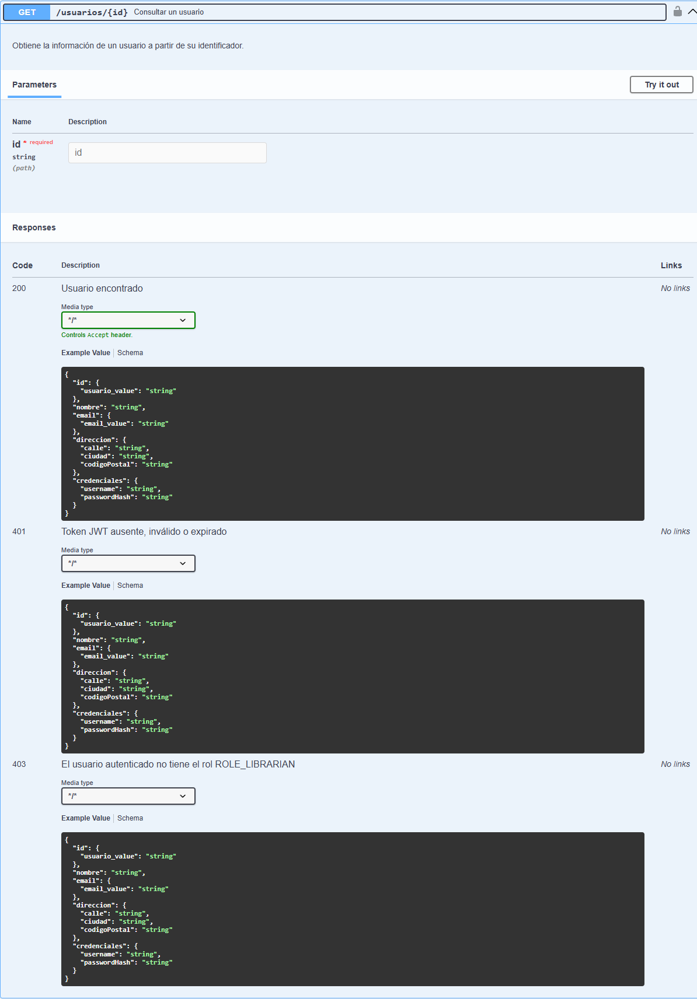

Obtiene la información de un usuario a partir de su identificador.

- **Parámetros:** `id` (path, requerido)
- **Autorización:** `ROLE_LIBRARIAN` (no hay chequeo de "dueño del recurso", por lo que no se permite `ROLE_USER`)
- **Respuestas:** `200` Usuario encontrado · `401` Token JWT ausente/inválido/expirado · `403` Rol incorrecto

### PUT /usuarios/{id}/email — Actualizar el email de un usuario

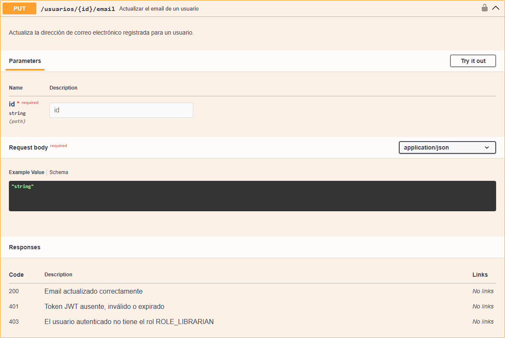

Actualiza la dirección de correo electrónico registrada para un usuario.

- **Parámetros:** `id` (path, requerido) · body: nuevo email (`string`)
- **Autorización:** `ROLE_LIBRARIAN`
- **Respuestas:** `200` Email actualizado · `401` Token JWT ausente/inválido/expirado · `403` Rol incorrecto

---

## notificacion-service (`http://localhost:8084`)

### POST /notificar — Enviar una notificación

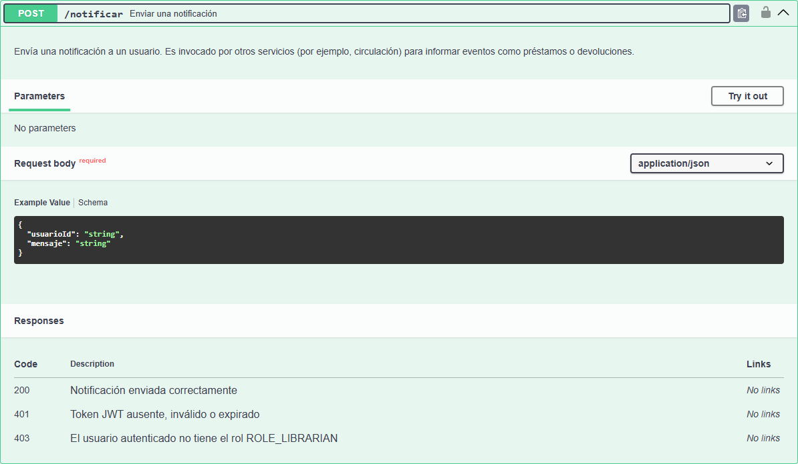

Envía una notificación a un usuario. Es invocado por otros servicios (por ejemplo, `circulacion-service` vía Feign) para informar eventos como préstamos o devoluciones, propagando el JWT del bibliotecario que originó la operación.

- **Autorización:** `ROLE_LIBRARIAN`
- **Respuestas:** `200` Notificación enviada · `401` Token JWT ausente/inválido/expirado · `403` Rol incorrecto
